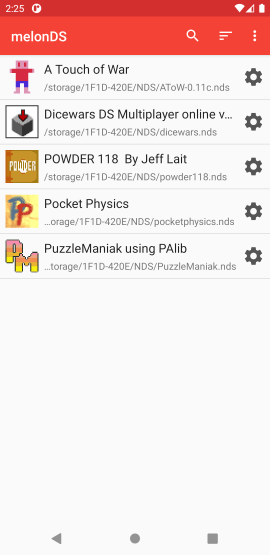
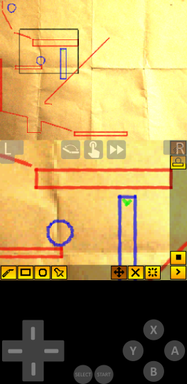
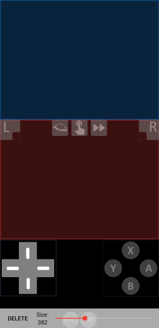

# melonDS Android port
This is a WIP Android frontend for the melonDS Android port. For the Android port of the emulator, check out https://github.com/rafaelvcaetano/melonDS-android-lib

|Rom List|Dark Theme|Pocket Physics|Layout Editor|
|---|---|---|---|
|||||

# Missing Features
*  Local Multiplayer
*  OpenGL renderer
*  DSi SD card support
*  Customizable button skins
*  More display filters

# Performance
Performance is solid on 64 bit devices with thread rendering and JIT enabled, and should run at full speed on flagship devices. Performance on older devices, specially
32 bit devices, is very poor due to the lack of JIT support.

# Integration with third-party frontends
It's possible to launch melonDS from third part frontends. For that, you will need to have the ROMs you want to launch already scanned by melonDS. Then, you can configure your
third-party frontend with the following configuration:
*  Package name: `me.magnum.melonds`
*  Activity name: `me.magnum.melonds.ui.emulator.EmulatorActivity`
*  Parameters (choose one):
    * `uri` (preferred) - a string with the [SAF](https://developer.android.com/guide/topics/providers/create-document-provider) URI of the NDS ROM (ZIP files are supported)
    * `PATH` - a string with the absolute path to the NDS ROM (ZIP files are supported)

# Building
To build the project you will need Android SDK, NDK and CMake.

## Build steps:
1.  Clone the project, including submodules with:
    
    `git clone --recurse-submodules https://github.com/rafaelvcaetano/melonDS-android.git`
2.  Install the Android SDK, NDK and CMake
3.  Build with:
    1.  Unix: `./gradlew :app:assembleGitHubDebug`
    2.  Windows: `gradlew.bat :app:assembleGitHubDebug`
4.  The generated APK can be found at `app/gitHub/debug`

If you want to create a release build, you will need to modify your `local.properties` file to include the following fields:  
*  `MELONDS_KEYSTORE=<path_to_your_keystore>`
*  `MELONDS_KEYSTORE_PASSWORD=<keystore_password>`
*  `MELONDS_KEY_ALIAS=<name_of_your_key_alias>`
*  `MELONDS_KEY_PASSWORD=<key_alias_password>`
